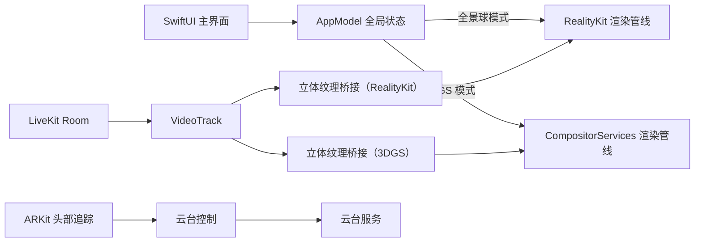
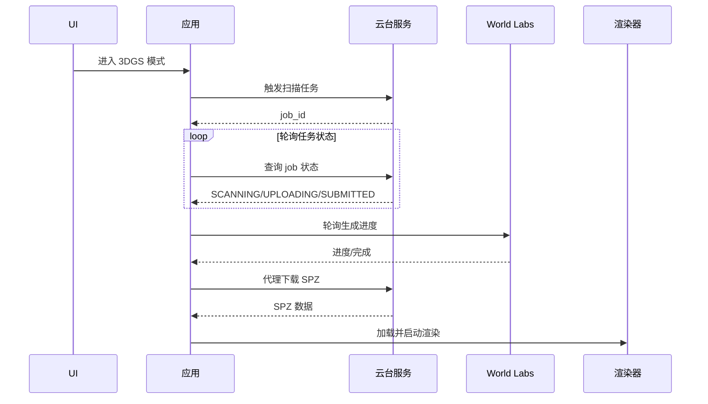
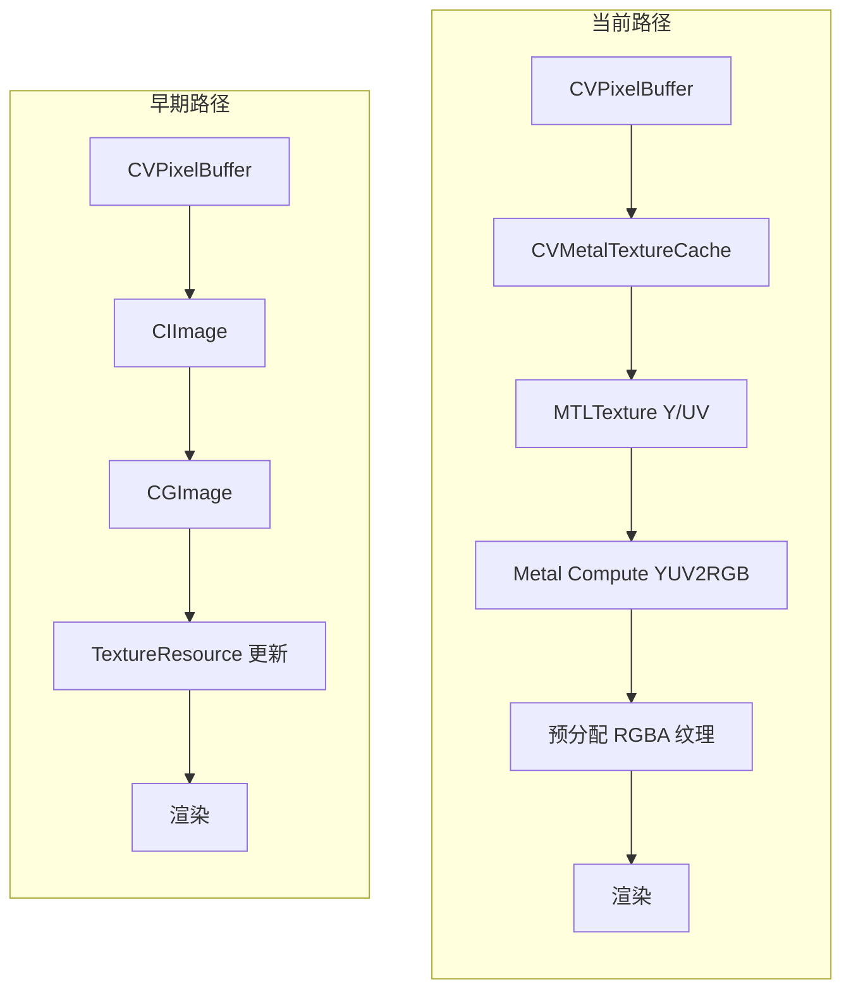

# EERenderer

## 项目概述
EERenderer 是一款面向 Apple Vision Pro 的 visionOS 应用，用于渲染类人机器人视角。应用提供两种沉浸式模式：
1) 全景球模式（RealityKit）：从云台服务端采集环境全景图，贴图到球体背景，并在前景叠加立体视频。
2) 3D Gaussian Splatting 模式（CompositorServices）：在线生成 3DGS 场景并渲染，同时叠加头部锁定的立体视频。

## 主要功能
- 双模式沉浸式渲染：全景球与 3DGS 可在 UI 中切换。
- LiveKit 视频流：订阅远端视频轨道并转为立体纹理供两种渲染管线使用。
- 头部追踪与云台跟随：使用 ARKit 追踪头部姿态，发送增量控制指令到云台。
- 在线 3DGS 生成：触发扫描与任务提交，轮询生成进度，下载 SPZ 并加载渲染。
- 应用内日志面板：实时查看关键流程和性能日志。

## 运行方式
1. 使用 Xcode 打开 HumanoidRenderer.xcodeproj。
2. 选择 Apple Vision Pro 设备或模拟器（visionOS 26.0+）。
3. 运行应用，进入主界面后设置服务器 IP。
4. 选择渲染模式并进入沉浸式空间。

## 配置说明
- 服务器 IP：在应用 UI 中设置，使用 AppStorage 持久化。
- LiveKit 参数：在 [HumanoidRenderer/LiveKit/View/LiveKitViewModel.swift](HumanoidRenderer/LiveKit/View/LiveKitViewModel.swift) 中配置 `API_KEY`、`API_SECRET`、`ROOM`。
- 网络：应用允许任意 HTTP 访问以便与本地服务交互（见 Info.plist）。

## 代码结构
- App 与 UI
	- [HumanoidRenderer/HumanoidRendererApp.swift](HumanoidRenderer/HumanoidRendererApp.swift): 应用入口与 ImmersiveSpace 配置
	- [HumanoidRenderer/ContentView.swift](HumanoidRenderer/ContentView.swift): 主界面与日志面板
	- [HumanoidRenderer/AppModel.swift](HumanoidRenderer/AppModel.swift): 全局状态
- 全景球渲染（RealityKit）
	- [HumanoidRenderer/ImmersiveScene/ImmersiveView.swift](HumanoidRenderer/ImmersiveScene/ImmersiveView.swift)
	- [HumanoidRenderer/ImmersiveScene/Background/BackgroundManager.swift](HumanoidRenderer/ImmersiveScene/Background/BackgroundManager.swift)
	- [HumanoidRenderer/ImmersiveScene/Utils/NetUtils.swift](HumanoidRenderer/ImmersiveScene/Utils/NetUtils.swift)
- 3DGS 渲染（CompositorServices）
	- [HumanoidRenderer/GaussianSplat/GaussianSplatRenderer.swift](HumanoidRenderer/GaussianSplat/GaussianSplatRenderer.swift)
	- [HumanoidRenderer/GaussianSplat/ContentStageConfiguration.swift](HumanoidRenderer/GaussianSplat/ContentStageConfiguration.swift)
	- [HumanoidRenderer/GaussianSplat/GaussianSplatVideoBridge.swift](HumanoidRenderer/GaussianSplat/GaussianSplatVideoBridge.swift)
- LiveKit 与视频桥接
	- [HumanoidRenderer/LiveKit/View/LiveKitViewModel.swift](HumanoidRenderer/LiveKit/View/LiveKitViewModel.swift)
	- [HumanoidRenderer/LiveKit/Utils/LiveKitToken.swift](HumanoidRenderer/LiveKit/Utils/LiveKitToken.swift)
	- [HumanoidRenderer/LiveKit/Utils/TrackTextureBridge.swift](HumanoidRenderer/LiveKit/Utils/TrackTextureBridge.swift)
- Metal Shader
	- [HumanoidRenderer/Shader/YUV2RGB.metal](HumanoidRenderer/Shader/YUV2RGB.metal): YUV 转 RGBA 与软边缘遮罩
	- [HumanoidRenderer/Shader/VideoQuadShader.metal](HumanoidRenderer/Shader/VideoQuadShader.metal): 立体视频四边形
- RealityKit 资源包
	- [Packages/RealityKitContent/Sources/RealityKitContent/RealityKitContent.swift](Packages/RealityKitContent/Sources/RealityKitContent/RealityKitContent.swift)

## 架构概览
EERenderer 由 UI 层、全局状态、视频与云台服务、两条渲染管线以及底层着色器与资源包构成。核心目标是将远端立体视频与环境背景在沉浸式空间中融合，并通过头部追踪驱动云台跟随。

## 工作流程

### 全景球模式流程
1. 进入沉浸式空间并初始化云台。
2. 触发环境扫描并下载全景图。
3. 将全景图贴到球体背景并完成材质烘焙。
4. 启动头部追踪，发送增量控制指令驱动云台跟随。
5. 接收 LiveKit 立体视频并叠加到前景平面。

### 3DGS 模式流程
1. 触发扫描任务并轮询本地任务状态。
2. 任务提交后轮询 World Labs 生成进度。
3. 生成完成后下载 SPZ 并加载 3DGS 场景。
4. 启动 CompositorServices 渲染循环并叠加立体视频。
5. 持续头部追踪与云台跟随。

### 视频与渲染协作
1. LiveKit 连接并订阅远端视频轨道。
2. 视频帧经由 Metal 计算着色器从 YUV 转换为 RGBA。
3. 纹理在不同渲染管线中复用并以立体方式显示。

### 头部追踪与云台跟随
1. ARKit 采集头部姿态并转换为欧拉角。
2. 进行突变过滤与基准更新。
3. 发送增量控制指令至云台服务。

## 渲染优化
根据 git log 的历史版本，早期视频桥接主要依赖 CIImage/CGImage 的 CPU 路径；当前版本已经迁移到 GPU 路径并复用纹理，显著降低了拷贝与分配成本。

### 早期实现
- 在 [HumanoidRenderer/LiveKit/Utils/TrackTextureBridge.swift](HumanoidRenderer/LiveKit/Utils/TrackTextureBridge.swift) 的早期版本中，每帧通过 `CIContext.createCGImage` 将 `CVPixelBuffer` 转为 `CGImage`，再调用 `TextureResource(image:)` 或 `replace(withImage:)` 更新纹理。
- 该路径包含 CPU 侧颜色转换与频繁的图像对象创建，主线程更新易导致抖动或掉帧。

### 当前实现
- 使用 `CVMetalTextureCache` 将 `CVPixelBuffer` 的 Y/UV 平面零拷贝映射为 `MTLTexture`，避免中间 `CGImage`。
- 通过 [HumanoidRenderer/Shader/YUV2RGB.metal](HumanoidRenderer/Shader/YUV2RGB.metal) 的计算着色器在 GPU 上完成 NV12 到 RGBA 转换。
- 在 [HumanoidRenderer/LiveKit/Utils/TrackTextureBridge.swift](HumanoidRenderer/LiveKit/Utils/TrackTextureBridge.swift) 使用 `LowLevelTexture` 预分配并复用纹理，再包装为 `TextureResource` 供 RealityKit 绑定，减少每帧创建与替换开销。
- 在 [HumanoidRenderer/GaussianSplat/GaussianSplatVideoBridge.swift](HumanoidRenderer/GaussianSplat/GaussianSplatVideoBridge.swift) 引入帧背压控制（信号量限制 GPU 同时处理帧数），避免队列堆积和延迟扩大。

## 分支说明
- `main`: 主分支，日常开发与集成。
- `test_mtp_latency`: 用于 MTP 延迟测试的实验分支。
- `test_render_latency`: 用于渲染延迟测试的实验分支。

## 环境要求
- Apple Vision Pro
- visionOS 26.0 或更高版本

## 备注
- 3DGS 在线生成依赖后端服务提供扫描与 World Labs 任务接口。
- 头部追踪通过 ARKit 获取姿态，并以增量方式驱动云台跟随。
